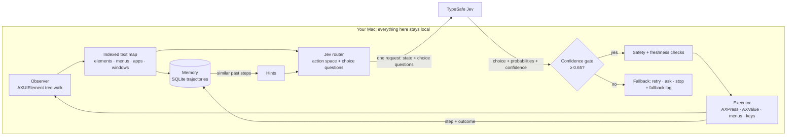

# JevOSX

**A coordinate-free, OCR-free macOS automation agent.** JevOSX reads the native Accessibility tree
(`AXUIElement`) of whatever is on screen, turns it into a compact indexed text map, and asks
[TypeSafe's Jev](https://docs.typesafe.ai/introduction), a "System One" decision model, to choose the next
operation and its target from a fixed menu of options. It then runs that choice deterministically through
Accessibility actions and keyboard events. Every run is saved to a local SQLite memory. Similar past runs
come back as hints, so repeated tasks get better over time.

There are no screenshots, no pixel guessing and no vision model. The model never outputs coordinates, selectors,
shell commands or free text. It only picks ids that the agent observed on this Mac.

Inspired by [jev-ultrafast](https://github.com/browser-use/jev-ultrafast) (browser) and typesafe-computer-use
(OCR-based desktop). JevOSX brings their typed-choice loop to the whole Mac using accessibility data instead of OCR.

---

## Contents

- [How it works](#how-it-works)
- [Repository layout](#repository-layout)
- [What Jev sees](#what-jev-sees)
- [Guarantees and guardrails](#guarantees-and-guardrails)
- [Setup](#setup)
- [Usage](#usage)
- [Memory and the learning loop](#memory-and-the-learning-loop)
- [Configuration](#configuration)
- [Performance](#performance)
- [Limitations](#limitations)
- [Development](#development)
- [Troubleshooting](#troubleshooting)

## How it works



One decision cycle:

1. **Observe.** The frontmost app's focused window is walked through the Accessibility API. Attribute reads are
   batched, one IPC round trip per element. Hidden, zero-size, off-screen and disabled elements are dropped.
   What remains becomes an indexed table such as `[3] textfield "To" = ""`. Menu-bar commands, other windows and
   running apps are collected as whole-Mac context.
2. **Recall.** Local memory finds finished runs with similar goals and similar screens. It maps what worked before
   (or had no effect) onto ids that are on screen now.
3. **Decide.** One Jev request carries the state plus a set of discrete choice questions: which
   **operation** (`CLICK`, `TYPE_TEXT`, `MENU`, `PRESS_KEY`, `SCROLL_*`, `OPEN_APP`, `FOCUS_WINDOW`, `WAIT`, `DONE`,
   `BLOCKED`), and, speculatively in the same round trip, the **target** for each operation. Only the target head
   of the chosen operation is validated and used.
4. **Gate.** If Jev's confidence in the operation or in the chosen target is below the floor (0.65 by default),
   nothing runs. The fallback policy re-observes, asks you, or stops, and the decision is written to a fallback log.
5. **Guard and act.** Safety rules run next (deny lists, confirmation for consequential labels such as *Delete* or
   *Buy*, password-field rules). The target handle is re-validated, then executed with `AXPress`, an `AXValue`
   write, a menu-item press, `AXRaise`, a scroll-bar value change or a CGEvent key chord.
6. **Settle and learn.** The loop waits for a cheap UI signature to stop changing, re-observes, labels the step
   *changed* or *unchanged*, and stores it. When the run ends, its status (optionally confirmed by a verifier or by
   you) decides how strongly it counts in future retrieval.

## Repository layout

```
jevosx/
├── observer/            # OS observer: Accessibility tree → Observation
│   ├── ax.py            #   pyobjc AXUIElement wrapper (batched reads, timeouts, typed errors)
│   ├── walker.py        #   bounded tree walk: pruning, labels, rows, visibility clip (platform-independent)
│   ├── menus.py         #   menu-bar walker → MENU targets with paths and shortcuts
│   ├── apps.py          #   running apps (NSWorkspace) + installed app bundles (Info.plist)
│   ├── desktop.py       #   MacDesktopObserver: frontmost app/window, web accessibility, caching
│   └── textmap.py       #   human-readable text map (`jevosx observe`)
├── router/              # Jev router
│   ├── client.py        #   HTTP/2 Jev client, retries, strict choice-only contract, answer validation
│   ├── space.py         #   dynamic action space: operations and compatible targets per observation
│   ├── policy.py        #   state building, context budget, request contract, decision decoding
│   ├── prompts.py       #   instructions sent with each question
│   └── text.py          #   TYPE_TEXT sources: text slots, goal literals, GENERATE via the writer
├── writer/              # Free-form text ("write a poem"): Jev picks the field, a writer fills in the words
│   ├── apple.py         #   Apple's on-device model via a compiled Swift helper (build, check, requests)
│   ├── apple_writer.swift  # the helper: Foundation Models over JSON stdin/stdout
│   ├── openai.py        #   optional OpenAI-compatible chat model
│   ├── base.py          #   when to offer writing, prompts, output cleanup
│   └── simulated.py     #   canned writer for demo mode
├── executor/            # Execution engine
│   ├── mac.py           #   MacExecutor: AX actions, value writes, scrolling, app activation/launch
│   ├── input.py         #   CGEvent keyboard (layout-independent Unicode) and opt-in pointer fallback
│   ├── keys.py          #   named key-chord vocabulary for PRESS_KEY
│   ├── safety.py        #   deny/confirm policy
│   └── base.py          #   Executor protocol and DryRunExecutor
├── memory/              # Local memory and learning layer
│   ├── store.py         #   SQLite trajectories (WAL, versioned schema, JSONL export/import, prune)
│   ├── embedding.py     #   deterministic hashed n-gram embeddings (numpy, no downloads)
│   └── retriever.py     #   similarity retrieval → actionable hints mapped to current ids
├── agent.py             # the loop: observe → recall → decide → gate → guard → act → settle → learn
├── config.py            # typed settings (TOML + .env + environment), strict validation
├── types.py             # shared data model (UIElement, Observation, Action, …)
├── ui/                  # local web console (`jevosx ui`)
│   ├── server.py        #   stdlib HTTP + Server-Sent Events, run manager, approvals, token/Host guards
│   ├── demo.py          #   simulated Mac + simulated decisions for `--demo`
│   └── static/          #   single-file front end (no external resources)
└── cli.py               # `jevosx run | observe | ui | write | diagnose | doctor | report | memory`
docs/                    # ROADMAP.md: research notes, phases and risks
examples/                # run_agent.py (Python API), dump_tree.py (inspect what the agent sees)
config/                  # jevosx.example.toml: every setting with its default
scripts/                 # install.sh (one-line installer), bootstrap.sh (venv + install + doctor)
tests/                   # offline tests: fake AX trees, fake desktop, mocked Jev endpoint
```

## What Jev sees

The request goes to `POST https://api.typesafe.ai/v1/systemone` with `{model, state, questions}`. The state
excerpt below is for a TextEdit window (`jevosx observe --json` prints the real one for any app):

```json
{
  "desktop": {"frontmost_app": "TextEdit", "bundle_id": "com.apple.TextEdit", "window": "Untitled",
              "focused_element": "[4] textarea \"Body\""},
  "elements": [
    {"index": 1, "role": "close button", "label": "close button", "ops": ["CLICK"]},
    {"index": 2, "role": "popup", "label": "Paragraph Styles", "value": "Body", "in": "toolbar", "ops": ["CLICK"]},
    {"index": 4, "role": "textarea", "label": "Body", "state": ["focused"], "ops": ["TYPE_TEXT", "CLICK"]}
  ],
  "visible_text": "…",
  "recent_actions": [{"step": 1, "action": "MENU [m2] File › New (⌘N)", "result": "ui changed"}],
  "memory_hints": [{"kind": "worked", "operation": "TYPE_TEXT", "target_id": "4", "past_runs": 3, "similarity": 0.82}],
  "text_slots": {"quote_1": "Hello from JevOSX", "email": "me@example.com"}
}
```

Every question is a discrete one-of-N `choice`:

```json
{
  "operation":      {"type": "choice", "criteria": {"CLICK": "…", "TYPE_TEXT": "…", "MENU": "…", "PRESS_KEY": "…",
                                                    "OPEN_APP": "…", "WAIT": "…", "DONE": "…", "BLOCKED": "…"},
                     "instructions": {"goal": "…", "rules": "…"}},
  "click_target":   {"type": "choice", "criteria": {"1": {"element": "[1] close button …"}, "2": {…}, "4": {…}}},
  "menu_target":    {"type": "choice", "criteria": {"m1": {"command": "File › New", "shortcut": "⌘N"}, …}},
  "key_target":     {"type": "choice", "criteria": {"RETURN": {…}, "CMD_S": {…}, …}},
  "text_slot":      {"type": "choice", "criteria": {"quote_1": {…}, "email": {…}}}
}
```

Jev answers each question with `{choice, probabilities (one per id), confidence}`.

**What leaves the Mac, and what doesn't:**

| Sent to TypeSafe | Stays local |
| --- | --- |
| Goal, instructions | AX handles, element frames/coordinates |
| Roles, labels, non-secret values, states of interactive elements | Screenshots (none are ever taken) |
| Visible static text (capped, 2,000 chars by default) | Password-field values (never read) |
| Menu command paths, app and window names | Secret text-slot values (sent as `••••••`) |
| Recent action descriptions, memory hints | The memory database, fallback log and traces |

## Guarantees and guardrails

**Strict choice schemas.** The client refuses to send anything that is not a `type: "choice"` question with 2–255
ids (`RouterContractError`). Before each request, `validate_request` checks three things. The operation options
equal the action space. Every `click_target` / `type_text_target` id is an `index` in the element table sent
with it. Every offered id resolves to a handle observed on this Mac. Answers are validated as a real distribution
over exactly the offered ids, and the choice must be the argmax. A malformed answer on the selected head raises
`JevResponseError` and nothing is executed. A malformed answer on an unused speculative head is ignored.

**Context guardrails.** These run before anything is serialized:
- subtrees outside the window or scroll-area clip are pruned, as are `AXHidden` subtrees and window chrome;
- zero-size elements are never indexed;
- read-only text fields become text, not controls;
- disabled and non-interactive elements are left out of the element table (`jev.include_disabled = false`);
- installed apps that aren't running are offered to `OPEN_APP` only when the goal names them;
- the serialized state has a hard budget (`jev.max_state_bytes`, 48 KB). Visible text is trimmed first, then
  history, then trailing elements. The focused element is never dropped, and dropped elements are removed from
  the target questions too, so ids and the table always match.

The walk itself is bounded by node count, element count, depth, children per node and wall time.

**Confidence gate and fallback.** `agent.min_confidence` (default **0.65**) is compared against the *weakest*
confidence among the answers that would drive execution: operation, chosen target, and text slot. `DONE` is gated
too, so an unsure `DONE` cannot end a run early. One exception: while the web console's own browser window is in front, the
agent may only open a new window or tab, or switch apps or windows. Those moves change nothing, so they are not gated by
default (`agent.gate_console_navigation = true` gates them too). Below the floor, `LowConfidenceError` is raised and
handled:

| `agent.low_confidence_policy` | Behaviour |
| --- | --- |
| `retry` (default) | withhold, wait, re-observe; after `max_low_confidence_retries`, stop with status `low_confidence` |
| `ask` | show you the proposed action; execute only if you approve, otherwise retry |
| `stop` | end the run immediately with status `low_confidence` |

Every withheld decision is appended to `agent.fallback_log` (`~/.jevosx/fallbacks.jsonl`) with the goal, app,
window, top options, confidence, floor and resolution. You can also pass your own handler:
`Agent(..., on_low_confidence=lambda exc, obs: "retry" | "execute" | "stop")`.

**Safety and freshness.**
- Deny-listed apps (Keychain Access and Passwords by default) are never operated.
- Labels matching consequential patterns (delete, erase, trash, buy, pay, transfer, shut down, …) and `CMD_Q` need
  confirmation. When there is no terminal to confirm in, they are declined.
- Password fields accept only secret text slots, and a text model is never used for them.
- The Apple menu is never offered.
- Right before execution the target is re-validated (same frontmost app, same role, still enabled). A stale target
  is re-observed, never guessed.
- Three consecutive actions with no visible change stop the run as `blocked`.
- A verifier (`--expect-text`) can reject a premature `DONE`.
- `--dry-run` decides without touching the Mac.

## Setup

**Requirements:** macOS (13 Ventura or newer recommended), Python 3.11+, and a TypeSafe API key.

**One-line install.** Open Terminal and paste:

```bash
curl -fsSL https://raw.githubusercontent.com/matthewagi/JevOSX/main/scripts/install.sh | bash
```

What the installer does, without needing `sudo`:
1. Finds Python 3.11+ (or gets Python 3.12 through [uv](https://docs.astral.sh/uv/) if you don't have it).
2. Downloads JevOSX to `~/JevOSX` and installs its dependencies.
3. Asks for your TypeSafe key (hidden input, stored in `~/JevOSX/.env` with `chmod 600`).
4. Opens the Accessibility settings pane.
5. Adds a `jevosx` command and an optional double-clickable `JevOSX.command` on your Desktop.
6. Offers to start the console.

Run it again to update. Overrides: `JEVOSX_DIR`, `JEVOSX_REF`, `JEVOSX_PYTHON`, and `JEVOSX_YES=1` to accept
the defaults without questions.

Or step by step:

```bash
git clone https://github.com/matthewagi/JevOSX.git && cd JevOSX
scripts/bootstrap.sh              # creates .venv, installs deps (incl. pyobjc), copies .env.example → .env, runs doctor
$EDITOR .env                      # set TYPESAFE_API_KEY=...
source .venv/bin/activate
jevosx doctor --live              # checks permissions and measures a real Jev round trip
jevosx ui                         # open the console and start giving commands
```

Manual install:

```bash
python3 -m venv .venv && source .venv/bin/activate
pip install -r requirements.txt -e .      # add -r requirements-dev.txt for tests/linting
export TYPESAFE_API_KEY=...
```

**Accessibility permission (required).** macOS only lets trusted processes read other apps' UI and send input.
The first `jevosx doctor`/`observe`/`run` triggers the system prompt. Enable the app that runs Python
(Terminal, iTerm, VS Code, …) under **System Settings › Privacy & Security › Accessibility**, then restart that
app. No Screen Recording permission is needed because no screenshots are taken.

**Browsers and Electron apps.** JevOSX sets `AXManualAccessibility` (Electron: Slack, VS Code, Discord, Notion…)
and `AXEnhancedUserInterface` (Chrome, Edge, Brave, Arc…) so their web content shows up in the tree. Safari
exposes web content natively. The first observation after an app launches can be sparse while the tree builds.

## Usage

### Console (web UI)

```bash
jevosx ui            # opens http://127.0.0.1:8765 in your browser and drives your real Mac
jevosx ui --demo     # simulated Mac + simulated decisions: try the whole loop on any OS, no API key
```

A chat-style console for giving the agent commands:

- **Command box.** Type what you want in plain English and press Enter. The options button sets the start app,
  success text, step budget, confidence floor, what happens when Jev is unsure (retry / ask me / stop), dry run,
  memory use, and text slots.
- **Live step stream.** Every decision appears as it happens: operation, target, whether it ran and how, a
  confidence meter with the floor marked on it, timings (Jev, observe, recall, act, settle), and memory hints.
  Expand *details* to see Jev's top alternatives for the operation and target.
- **Approvals.** Consequential steps (e.g. *Delete*) and, with "Ask me", low-confidence steps pause with
  **Allow / Deny** buttons. **Stop** (or ⌘.) interrupts after the current step.
- **Side panel.** *Screen* shows exactly what Jev sees: the indexed interactive elements, menu commands and visible
  text. *Memory* lists past runs; mark them ✓/✗ to teach retrieval. *Log* is a raw event stream.
- **Security.** It listens on 127.0.0.1 only. Every API call needs a per-session token, and requests with a
  foreign `Host` are rejected, so other web pages can't drive your Mac through it.

Demo mode simulates Finder, TextEdit, Safari and Notes, with a transparent keyword policy standing in for Jev.
The router contract, confidence gate, safety approvals, memory and streaming are the real code, so it behaves
exactly like a live run apart from who makes the decisions. The example cards cover a multi-step task, a web
search, write-and-save, a step needing approval, and a vague request that the confidence gate withholds.

### CLI

```bash
# See exactly what the agent sees (no API key needed). Switch to the target app within 3 s.
jevosx observe --delay 3
jevosx observe --delay 3 --menus
jevosx observe --delay 3 --json > state.json      # the literal Jev state + choice questions (+ size on stderr)

# Pursue a goal. Quoted text in the goal becomes typeable text (no text model needed).
jevosx run 'Create a new document and type "Meeting notes for Monday"' --app TextEdit --expect-text "Meeting notes"

# Provide named text slots for forms (secret-looking names are masked and allowed into password fields).
jevosx run "Fill in the sign-up form and submit it" --slot email=me@example.com --slot password=hunter2

# Inspect a decision without executing anything
jevosx run "Open System Settings and show the Wi-Fi pane" --dry-run

# Tighter supervision
jevosx run "…" --step                                  # approve every action
jevosx run "…" --min-confidence 0.8 --on-low-confidence ask
jevosx run "…" --trace run.jsonl --feedback            # JSONL trace; label the run for memory at the end
```

Exit codes: `0` success/done, `1` blocked, failed, low confidence or out of steps, `2` configuration or platform error.

### Writing new text

Jev only chooses; it never writes. When a goal asks for text that is not in it ("write a poem about autumn in
TextEdit", "reply to Anna saying I'm late", "summarize this page in a new note"), JevOSX offers one more text option,
`GENERATE`. If Jev picks it for the field it chose, a *writer* composes only that field's content:

- **Apple's on-device model** (the default on macOS 26 with Apple Intelligence turned on). It is free and private,
  and it works offline. JevOSX compiles a ~150-line Swift helper once with the Command Line Tools into
  `~/.jevosx/bin/`; Apple's Python SDK would need the full Xcode.
- **Any OpenAI-compatible model** set in `[text_model]`, for Intel Macs or older macOS.

```bash
jevosx run "Open TextEdit and write a short poem about autumn"
jevosx write "a haiku about the sea"     # try the writer on its own
jevosx write --check                     # is Apple's model ready? If not, it says why and how to fix it
```

The writer never fills password fields. It gets screen text as context only, and it composes each field once per
run, so a retry types the same text instead of a new poem. Goals that name the text (`type "hello"`) never use it.

### Python API

```python
from jevosx import Agent, Settings

settings = Settings.load()  # jevosx.toml / ~/.config/jevosx/config.toml + .env + env
with Agent.from_settings(settings) as agent:
    for event in agent.iter_run(
        'Create a new document and type "hello"',
        app="TextEdit",
        verifier=lambda obs: "hello" in obs.text,  # independent success check for DONE
    ):
        print(event.step, event.status, event.action, event.decision["gate_confidence"], event.timings)
    result = agent.last_result
    print(result.status, result.steps, result.elapsed_ms)
```

See [`examples/run_agent.py`](examples/run_agent.py) for a complete script with verification, confirmation and
feedback, and [`examples/dump_tree.py`](examples/dump_tree.py) for inspecting observations.

The layers are independent and easy to swap. `Agent` takes any `Observer` and `Executor` (see
`jevosx/observer/base.py` and `jevosx/executor/base.py`), a `JevRouter`, an optional `MemoryStore`, and hooks for
`confirm` and `on_low_confidence`.

## Memory and the learning loop

- **Storage.** `~/.jevosx/memory.db` (SQLite, WAL) holds `episodes` (goal, status, model, timings) and `steps`
  (app, window, a compact screen summary, operation, stable target key, probability, confidence, outcome).
  Goal and screen embeddings are stored with the rows. Nothing is uploaded.
- **Stable target keys.** Elements are remembered by role + AX identifier or normalized label + container, with
  counts normalized so `Inbox (3)` matches `Inbox (12)`. Menu commands, keys, apps and windows use their own keys.
- **Embeddings.** Deterministic signed feature hashing over words, bigrams and character trigrams (numpy). There
  is no model download, it works offline, and it is stable across processes.
- **Retrieval.** Top goal-similar finished episodes → steps taken on similar screens → mapped onto the current
  action space. Only steps whose target is on screen now become hints:
  - `worked`: changed the UI in a successful or done run;
  - `no_effect`: changed nothing;
  - `finished`: this screen was the final state of a successful run, which is evidence for `DONE`.

  Hints are added to `state.memory_hints` and annotated directly on the matching target option. Jev's instructions
  describe them as weak evidence.
- **Feedback.** A run verified by `--expect-text` / `verifier` is stored as `success` (weight 1.0). A plain
  `DONE` is stored as `done` (0.6). `--feedback`, `agent.feedback(id, ok)` or `jevosx memory label ID success|failed`
  promote or demote a run. Failed and blocked runs only contribute `no_effect` hints.
- **Maintenance.**
  ```bash
  jevosx memory stats | list | show ID | label ID success | forget ID | prune --keep 2000
  jevosx memory export trajectories.jsonl      # portable JSON-lines (no vectors; rebuilt on import)
  jevosx memory import trajectories.jsonl
  ```
  Typed text is not stored unless `memory.store_typed_text = true`. Secret slots are never stored.

## Configuration

Copy [`config/jevosx.example.toml`](config/jevosx.example.toml) to `./jevosx.toml` or
`~/.config/jevosx/config.toml`, or pass `--config PATH`. It lists every setting with its default. Unknown keys
and wrong types are rejected when the config loads.

| Environment variable | Purpose |
| --- | --- |
| `TYPESAFE_API_KEY` | Jev API key (required for `run`) |
| `JEV_MODEL` | Jev model, default `jev-latest` (pin e.g. `jev-1.13.0` for reproducibility) |
| `TYPESAFE_ENDPOINT` | override the System One endpoint |
| `JEVOSX_CONFIG`, `JEVOSX_MEMORY_PATH`, `JEVOSX_MAX_STEPS` | config file, memory database, step budget |
| `TEXT_MODEL`, `TEXT_MODEL_BASE_URL`, `TEXT_MODEL_API_KEY` | optional OpenAI-compatible writer for `TYPE_TEXT` |

A `.env` file in the working directory is loaded automatically. Real environment variables always win.

**Where `TYPE_TEXT` values come from.** Jev chooses; it never writes text. Values come from:
1. the goal itself:
   - quoted literals (`"…"`, `“…”`, `` `…` ``) become slots `quote_1`, …;
   - the phrase after *search for / look for / look up / google / type / enter / say* becomes `phrase_1`, …
     ("look for pictures of red flowers in Safari" → `pictures of red flowers`);
   - URLs and domains become `url_1`, …;
2. `--slot NAME=TEXT` / `text_slots={...}`. With several slots, Jev picks the right one in the same request;
3. optionally, a small OpenAI-compatible model (`[text_model]`, off by default), offered as `GENERATE`.

If none of these is available, `TYPE_TEXT` is not offered at all.

## Performance

- **Jev.** TypeSafe reports that Jev answers typed questions in one parallel pass in roughly 70–500 ms, with free
  output tokens. JevOSX makes **one request per decision**: operation and every target head share one round trip
  on a pooled HTTP/2 connection, so the TLS handshake is paid once. `jevosx doctor --live` measures your actual
  round trip.
- **Observation.** This is usually the larger cost. It scales with the size of the frontmost window's tree:
  small native windows take tens of milliseconds, large web pages take longer. Limits: `observer.time_budget_s`
  (1.5 s), `max_nodes`, `max_elements`. Menu walks are cached per app for `menu_cache_ttl_s`. `jevosx observe`
  prints nodes visited and walk time.
- **Settling.** After an action the loop polls a cheap signature (frontmost app, window title, focused element)
  every 50 ms until it is stable, capped at 0.8 s, instead of sleeping for a fixed time.
- Per-step timings (`observe`, `recall`, `decide`, `jev`, `act`, `settle`) are printed by `jevosx run` and included
  in every `StepEvent` and trace line.

## Limitations

- Only apps that expose an accessibility tree can be driven. Canvas-rendered UIs (games, some design tools,
  remote desktops) and apps with custom unlabeled controls expose little or nothing. The opt-in
  `executor.pointer_fallback` clicks an element's own AX frame centre, but it still needs the element to exist.
- The observer walks the focused window (including attached sheets) plus open menus. Other windows are reachable
  through `FOCUS_WINDOW`.
- Secure input (password prompts, some banking apps) can block synthetic keystrokes system-wide.
- Some cross-app menus are populated lazily and can be stale for up to `menu_cache_ttl_s`. Pressing a menu item
  that has become disabled fails safely and shows up as a failed step.
- `DONE` is Jev's judgement. Use `--expect-text` or a `verifier` when outcomes matter.
- Platform-independent logic (walker, menus, router, client, memory, safety, agent loop) is unit-tested on every
  OS. The pyobjc-backed modules (`observer/ax.py`, `observer/desktop.py`, `executor/mac.py`,
  `executor/input.py`) are covered in CI by macOS symbol and smoke tests. Driving real apps needs an interactive
  macOS session with the Accessibility permission granted.

## Development

```bash
pip install -r requirements-dev.txt -e .
pytest -q            # offline: fake AX trees, a fake desktop state machine, a mocked Jev endpoint
ruff check . && ruff format --check .
mypy jevosx
```

CI (`.github/workflows/ci.yml`) runs lint, type checks and tests on Ubuntu (Python 3.11 and 3.12) and on macOS.
On macOS the real pyobjc bridges are installed and every Accessibility and CGEvent symbol the code uses is checked.

## Troubleshooting

| Symptom | Fix |
| --- | --- |
| `Accessibility access is not granted` | Enable your terminal/IDE in System Settings › Privacy & Security › Accessibility, then restart it. After a Python upgrade, remove and re-add the entry. |
| Browser pages show almost no elements | Give Chrome/Electron a second after launch (web accessibility turns on lazily). In Safari, make sure the page has finished loading. |
| Runs end with `low_confidence` | The screen is ambiguous for the goal. Make the goal more specific, add `--app`, use `--on-low-confidence ask`, or lower `--min-confidence`. Review `~/.jevosx/fallbacks.jsonl`. |
| `TYPE_TEXT` never happens | Put the text in quotes in the goal or pass `--slot`. For new text ("write a poem"), run `jevosx write --check`. |
| `jevosx write --check` says Apple Intelligence is off | System Settings › Apple Intelligence & Siri → turn it on; the model downloads in the background. `sdkMissing` means the Command Line Tools are older than macOS 26: update them, then `jevosx write --rebuild`. |
| Keystrokes go to the wrong app | The executor re-activates the observed app and re-validates the frontmost pid before input. Avoid switching apps during a run. |
| `Jev rejected the API key` | Check `TYPESAFE_API_KEY` (`jevosx doctor`). |
